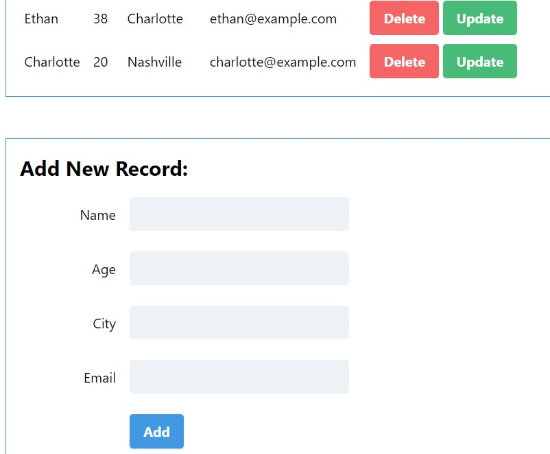

# CRUD App (Flask + HTML + Tailwind + JS + MongoDB)

Performing CRUD operations on DB from client UI.




## Backend/ Server: Python Flask
** _server.py_.

## Frontend/ Client: HTML, Tailwind, JS
** _index.html_.

## DB: MongoDB
** Collection's document format:
```
{
  name: <String>
  age: <Int32>
  city: <String>
  email: <String>
}
```
